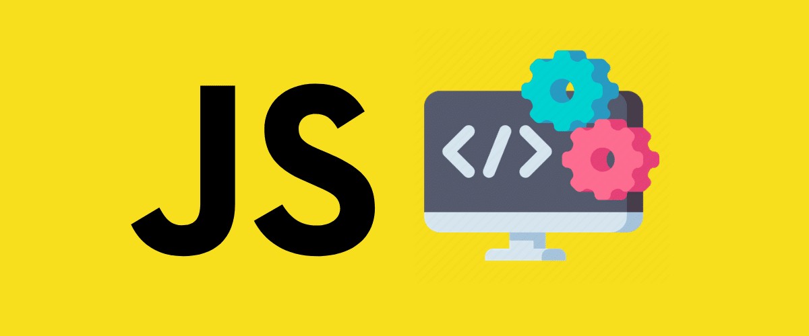

# Javascript-ES6-Essencial

    

> Instruções essenciais e lógica de programação  da linguagem Javascript ES6 +

## 🚀 Tecnologias

- Javascript
- Node JS
- NPM

#
## ⚙️ NodeJS & Code Runner
Para executar os comandos do javascript direto no terminal do VSCode é preciso instalar o node JS na máquina e uma extensão do VSCode chamada Code Runner.

 Para configurar o Code Runner corretamente vamos em file\preferences\settings na barra de busca procure por "terminal", localize a opção code-runner:run in terminal e marque a caixinha.

Para executar salve o arquivo e utilize o atalaho ctrl+alt+n

Para executar apenas um trecho de código do arquivo selecione o trecho de códigocom o mouse e utilize o atalho ctrl+alt+n

Outra forma de executar o arquivo é digitar no terminal do VSCode - node e o nome do arquivo.

#
## ⚙️ Configurando o Prompt com NPM
Para que o comando prompt() funcione corretamente no terminal do VSCode com o node precisamos intalar o pacote prompt-sync do NPM  - para isso abra a linha de comando do seu sistema operacional e digite - npm install prompt-sync

 Para que o pacote prompt-sync funcione em nosso arquivo precisamos utilizar a linha de comando
    const prompt = require("prompt-sync")({sigint: true}); possibilitando o uso do recurso.

#
## 📢 Contato

🌐 [linkedin.com/in/diogobarros-code](https://www.linkedin.com/in/diogobarros-code/)

📧 [diogobarros.code@gmail.com](diogobarros.code@gmail.com)